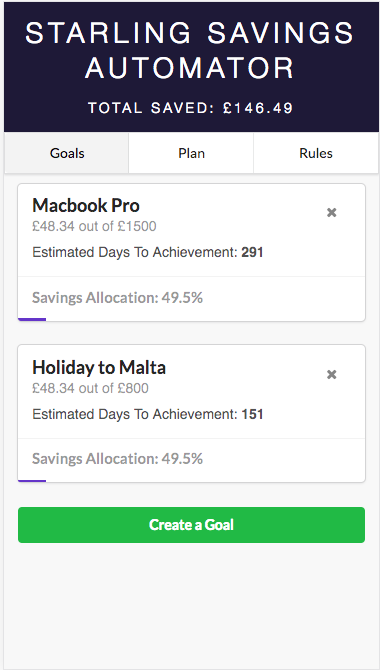
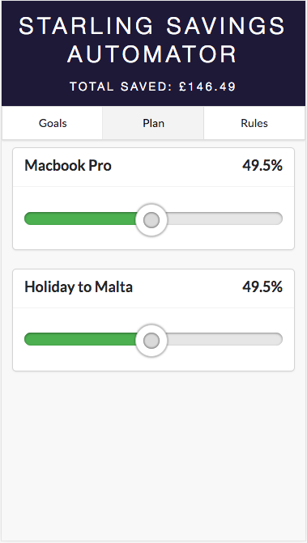

# Starling Savings Automator

An automated savings app which allows you to automatically allocate funds to your savings account based on customisable rules, and track your progress towards savings goals.

### Setting up some savings rules


### Tracking progress



### Customising savings allocation toward our goals




# Deployment

The React Redux application is based on [this starter kit](https://github.com/davezuko/react-redux-starter-kit) and is comprised of a simple REST API written in javascript using node.js with express.

## Getting Started
Please also take a look at the higher-level [Getting Started Guide](http://developer.starlingbank.com/get-started) on our site, which covers usage of our API as a whole.

### Prerequisites

The only prerequisite is [Node.js](https://nodejs.org). The best way to install Node.js is with [nvm](https://github.com/creationix/nvm).

### Installation

From the root of the project, install dependencies as follows. Use either the `yarn` or `npm` package manager.

```bash
yarn install
```

#### Start the application

```bash
yarn run dev
```

This will serve the client application on `localhost:3000` when using the default configuration.

### Configuration

You must register an application on the [Starling Developers](https://developer.starlingbank.com/get-started) site
 to obtain a `client_id` and `client_secret`. The `client_id` and `client_secret` should then be configured in the `server/config.json` file.
 The redirect URL registered in the developer portal must match the configured URL in this application.

The `config.json` file will look like this
```JSON
{
  "clientId": "<application client id>",
  "clientSecret": "<application client secret>",

  "cookieSecret": "21e361d0-ff2c-4763-a084-1032f2103ce8",

  "productionApi": "https://api.starlingbank.com",
  "personalAccessToken": "<personal access token>",

  "SANDBOX_CONFIG_COMMENT": "Do not keep the store file in the app root dir or it will restart everytime it is written to!",
  "sandboxLocalTokenStore": "../starling-api-web-starter-kit-sandbox-token-store.json",
  "sandboxApi": "https://api-sandbox.starlingbank.com/",
  "sandboxAccessToken": "<sandbox access token from Starling Developers site>",
  "refreshToken": "<refresh token from Starling Developers site>",

  "oauthApi": "https://oauth.starlingbank.com",
  "oauthRedirectUri": "http://localhost:3000/api/oauth/redirect"
}
```
The missing bits of config are specific to your account - your application, your sandbox customer, your personal access.

You can fill in this config as suits your use-case, be it personal access, sandbox, or oauth/production. 

#### OAuth/Production
Simply replace `<application client id>` and `<application client secret>` with the `client_id` and `client_secret` for your application.

```JSON
{
  "clientId": "<application client id>",
  "clientSecret": "<application client secret>",
  
  "oauthRedirectUri": "http://localhost:3000/api/oauth/redirect"
}
```

#### Sandbox
For the sandbox environment setup, use the config file, `config.json`, correctly filling in the following fields:
```JSON
{
  "clientId": "<application client id>",
  "clientSecret": "<application client secret>",
 
  "SANDBOX_CONFIG_COMMENT": "Do not keep the store file in the app root dir or it will restart everytime it is written to!",
  "sandboxLocalTokenStore": "../starling-api-web-starter-kit-sandbox-token-store.json",
  "sandboxApi": "https://api-sandbox.starlingbank.com/",
  
  "sandboxAccessToken": "<sandbox access token from Starling Developers site>",
  "refreshToken": "<refresh token from Starling Developers site>",
}
```
Where the `sandboxAccessToken` and `refreshToken` are the sandbox customer's access and refresh tokens from the [sandbox environment](https://developer.starlingbank.com/sandbox).

You can then start then select the sandbox from the landing page of your application.

<blockquote>
Note: the current implementation requires the refresh token to be replaced on server restart. This is temporary, as a programmatic method for retrieval of an application's sandbox customers is in the works.
</blockquote>

#### Personal Access
This starter kit can also be used to access your own Starling Bank data, right out of the box. 
This can be achieved by entering your token into the `config.json` file under `personalAccessToken`.

```JSON
{
  "personalAccessToken": "<personal access token>",
}
```
Your personal access token can be obtained from your [developer account](https://developer.starlingbank.com/token) after linking it to your customer account.

## Mobile Starter Kit Users

Those using the [React Native mobile starter kit](https://github.com/starlingbank/developer-api-mobile-app-starter) need to also clone this repo and follow the installation instructions above, while replacing the contents of the `config.json` file with that given in the mobile starter kit [README.md](https://github.com/starlingbank/starling-api-mobile-starter-kit)   
